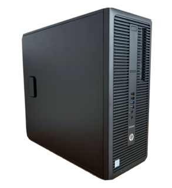
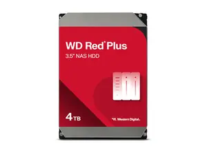
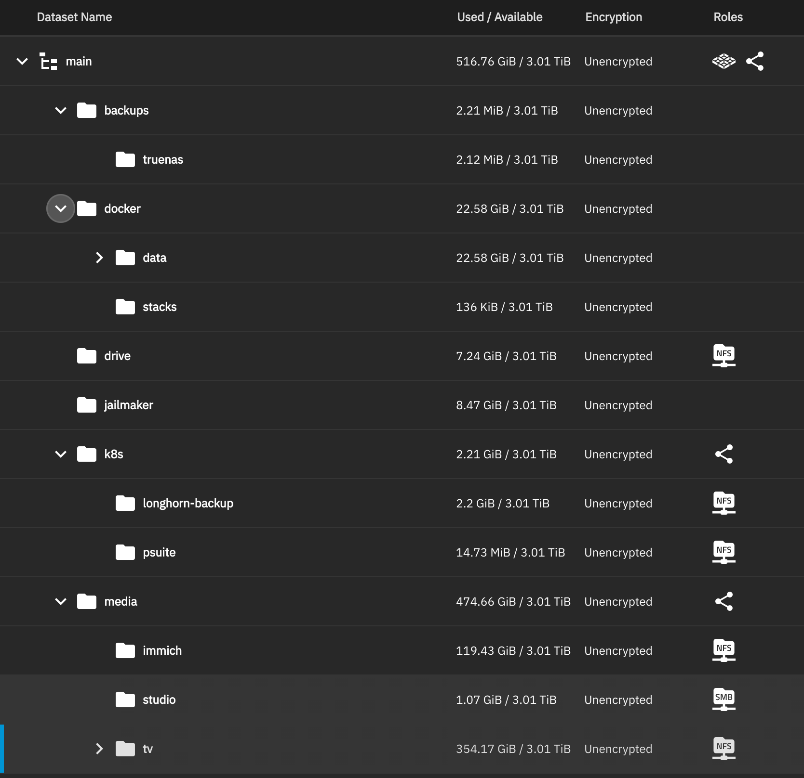
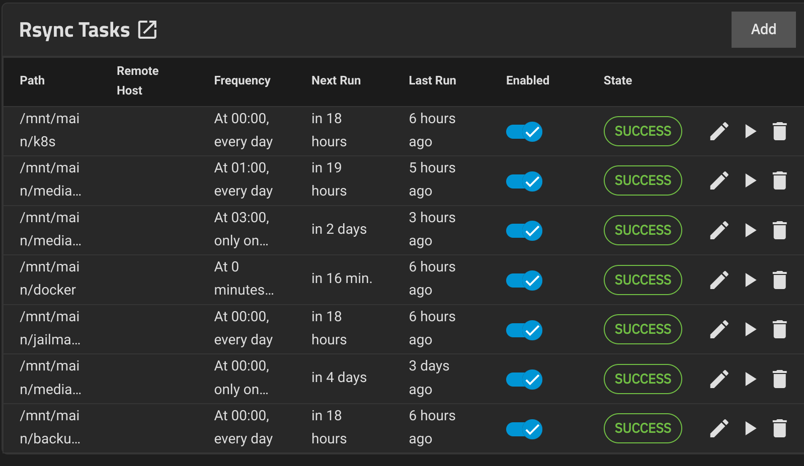
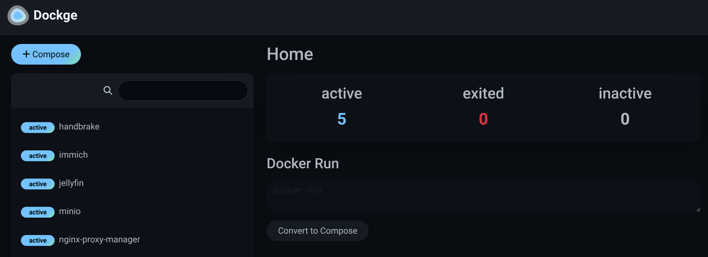
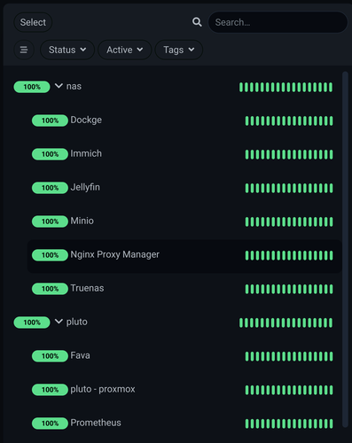
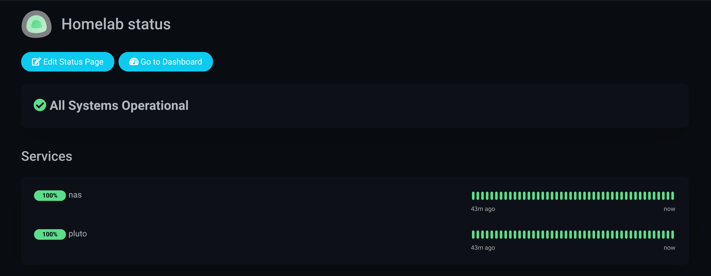

+++
title = "My Budget 4TB NAS setup"
description = "How I setup a high performing NAS server on a budget"
date = "2022-05-30"
tags = ["nas", "homelab", "articles"]
author = "Jayadeep KM"
toc = true
series = ["Homelab NAS"]
projects = ["NAS"]
+++

I wanted to setup a NAS server for quite some time. So finally I took the time to put together a NAS which is high-performing and on a tight budget. Let me walk you through the hardware and software components for the NAS and how I set them up.

# The Case and CPU

NAS server typically don't have high CPU requirements. Yet I wanted something which can run a few docker containers and is also extensible. That's how I came across this used PC - **HP EliteDesk 800 G2** on [ebay](https://www.ebay.ch/itm/255736941927). It was perfect for my use case due to following reasons,

* I5 6th Gen is power efficient and can easily run a few docker containers in additional to NAS server components
* There is slot for 3 Hard disk drives and SSDs. There are 5 Sata ports available.
* Highly extensible with 3 x4 PCIE lanes  and a x16 PCIE lane
* Supports 64GB of ram. The item came with 8 GB included (2x4GB) which was enough for a start.
* It supports Intel QuickSync for video transcoding

The Motherboard and CPU doesn't support ECC memory. But it was a tradeoff that I was willing to take.

**Cost: 70 Euros**

# Hard Disks

This is where I made my first mistake. I went for really cheap SSDs from Aliexpress. I bought 2 4TB harddisks from a seller named **KANDA Store** [here](https://www.aliexpress.com/item/1005005796672976.html?spm=a2g0o.order_list.order_list_main.39.2cd91802vt80V6). 4TB SSDs for 40$ was too good to be true, but I was stupid to not realize it. As expected, they didn't last for long. It is probably a 64GB memory card embedded in a SSD case. There goes 80$ down the drain.

Learning from my mistake, I ordered a couple of WD Red Plus 4TB from [Digitec](https://www.digitec.ch/en/order/117157227). There is little to no noise, and the performance was better than I expected.

This was the most expensive component of the NAS build. As someone who takes backups seriously, it was well worth to spend on reliable hard-disks.

I had a 120GB SSD from an old laptop laying around. I decided to use that as the boot disk.

The layout i was planning for was pretty simple. Just 2x4TB disks in mirrored pool with 120GB ssd as boot drive. This gives me the redundancy I needed, and gives ~3.6TB of usable space for storage.

**Cost: 220 Euros**

# Memory

The PC came with 8GB of RAM included. I did the initial build with that and it was more than enough. Then I decided to run more apps like Jellyfin, Immich and Minio on the NAS. Then it made sense to add more RAM.

The motherboard was 4 slots availble for installing ram. So I bought two 16GB memory sticks from Aliexpress [here](https://www.aliexpress.com/item/1005002946536496.html?spm=a2g0o.order_list.order_list_main.5.2cd91802vt80V6). This gave me 32GB of RAM with room for expansion later if needed.

**Cost: 54 Euros**

# Total Cost

The minimal version of the NAS was ready for ~290 Euros. The additional RAM and a few other components (lan cables, switch, SATA cables etc.) the total cost came to over 400 Euros. But I was able to cut down my cloud spending on backups and google storage to compensate this.

# Services I run

Here is a screenshot of my storage layout.

Below is the list of important services my NAS runs,

* NFS server used by my homelab kubernetes cluster for PVC backups
* NFS server for Immich, an alternative to google photos for storing my photos and videos
* Samba server `studio`, used for video editing across devices
* NFS server for `tv`. It hosts my home videos as well as content I download through *arr stack (I will do a separate post on how to set this up)

# Data Protection

By moving my digital life to a self maintained NAS server, I also bear the risk of losing everything in the event of a catastrophic failure (as it already happened when I bought the SSDs from Aliexpress and both SSDs failed at the same time). So it is important to have a offsite or cloud backup for the entire NAS where we can restore from.

Hetzner [Storage box](https://www.hetzner.com/storage/storage-box/) was the perfect solution for this. 1 TB of storage only costs ~3.8 Euros per month. It comes with SSH and Rsync access. I just had to setup rsync cronjobs in my NAS to backup periodically.

Another important part is to setup alerts correctly. Truenas has a sensible default configuration for alerting. I used telegram alerts in addition to email notifications. I already had a `homelab` channelsetup in Telegram which I use for alertmanager notifications, so it made sense to re-use it for NAS as well.

# Running Apps

I was hesitant to use the hypervisor from truenas to run apps, as VMS are more resource intensive than docker containers. Then I came across this cool project named [Jailmaker](https://github.com/Jip-Hop/jailmaker). By following the tutorial provided on the readme, I was able to quickly set it up along with Docker and [Dockge](https://dockge.kuma.pet/)

Dockge is a UI on top of docker and docker-compose. It lets you create and manage docker stacks through UI. It was quite handy given the limited shell access from Truenas (and the additional pain of exec-ing into the Jails)

I run the following services in Dockge

* Handbrake -> I use it for transcoding videos when required
* Immich -> Alternative to Google photos. It has almost all the features google photos has, and very similar UI.
* Jellyfin -> For media playback across devices. I was able to setup hardware transcoding using Interl QuickSync by setting up GPU passthrough in Docker.
* Minio -> Alternative to Amazon S3. I use it for restic backups from my PC and a few apps running on k8s
* Nginx Proxy Manager -> A graphical front-end to Nginx. I use it as a reverse proxy and certificate manager for the above apps

# Monitoring and Uptime checks

So I have alerts setup if something is wrong with the regular operation of NAS. What about Apps which are running in docker? What if the whole NAS is down or network is down?

For this, I have 2 more things setup.

##### Healthchecks.io

[healthchecks.io](https://healthchecks.io/) is a dead-man-switch service which notifies you if a service is down. The way it works is quite simple. The server has to ping the health-check endpoint in a predefined interval (I set it to 1 min in my case). If it fails to do so, the service will notify you by email or any other means. This is quite handy to notify when the network itself is down or the whole NAS has stopped responding.

##### Uptime Kuma

[Uptime Kuma](https://github.com/louislam/uptime-kuma) can ping your servies on regular intervals and notify if the service is down. It even gives a nice status page summarizing the uptime of various servies.

I'm running Uptime kuma in my kubernetes cluster. So unless both k8s and NAS apps fail at the same time, this should work as expected.

# Conclusion

Was it worth the effort and money? Absolutely! Setting up everything and configuring the automations, backups etc. took quite a long time. But Now I have a reliable storage service which is good enough for the next 3 years at-least.
