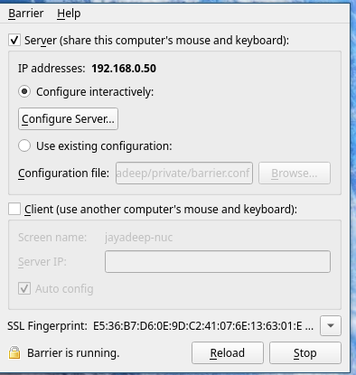

# Sharing Keyboard and Mouse across multiple devices

My personal work setup consists of a Reddragon K552 mechanical keyboard,
a Zebronics RGB Mouse and a 2K display. It ain't much, but I love
working with it.
And that's why I want to reuse the same setup for my office work
environment as well. I could buy the same components again and setup
another desk, but I prefer a software based approach to tackle this
challenge

## Sharing Keyboard and Mouse using Barrier

Initially I thought of buying a KVM switch. But then I found this gem:
<https://github.com/debauchee/barrier>. Let me show you how to configure
barrier to share keyboard and mouse over wifi.

First, make sure your main computer has a static IP. Most likely your
router has an option to automatically assign a fixed ip to the computer.
Or you can set a static ip in network connection setttings.

Then install Barrier from the above link. You can find the installation
steps for Linux, windows and Mac.

In my case, it was easy (I'm running Arch linux)

```
sudo pacman -S barrier
```

There is one step you need to do to get it to work :- setup ssl
certificates. There is a bug in Barrier installation, so barrier doesn't set it up by default, so
I had to dig around and find a way to do it. Here is the github issue
corresponding to the same: <https://github.com/debauchee/barrier/issues/231>

In linux:

```
cd ~/.local/share/barrier/SSL/
openssl req -x509 -nodes -days 365 -subj /CN=Barrier -newkey rsa:4096 -keyout Barrier.pem -out Barrier.pem
```

In Mac:

```
cd /Users/[username]/Library/Application Support/barrier/SSL
openssl req -x509 -nodes -days 365 -subj /CN=Barrier -newkey rsa:4096 -keyout Barrier.pem -out Barrier.pem
```

Now open barier in the main machine. On barier settings, enable SSL. It
doesn't work without enabling ssl, so I don't know why this option is
disabled in the first place.

Then click on configure server and add a new client. If you know your
other machine's hostname, use that as client name. Drag the client to
correct position like how you would configure multiple screens.

On the client machine (you can have multiple clients), install barrier
and setup certificates as above. Make sure the client name there matches
the client name configured in the main machine, otherwise it won't
connect. Now start the client. The server will ask for verification of
the client when it connects for the first time. Then you should be able
to move the mouse across both machines. Keyword will work on whichever
screen has the mouse active.



Barrier is now ready to use. There is one additional step I have done in
my case. I have configured a shortcut to bind the devices to one
particular machine. When I'm working entirely on one
machine, I don't want the mouse to accidentally go to other machine and
click on something. It can be configured from configure server ->
hotkeys


## Sharing displys across multiple devices.

This one is really tricky. I'm currently exploring [Miraclecast](https://github.com/albfan/miraclecast)
to cast my mac over wifi to Linux machine.
I'll update this article if I find a good solution. For now, I'm just
connecting both devices using multiple cables to the same display and
just adjust the source in the monitor whenever I switch to the other
device. If you are using windows or mac for both the machines, it might
be easier to get it to work. 

